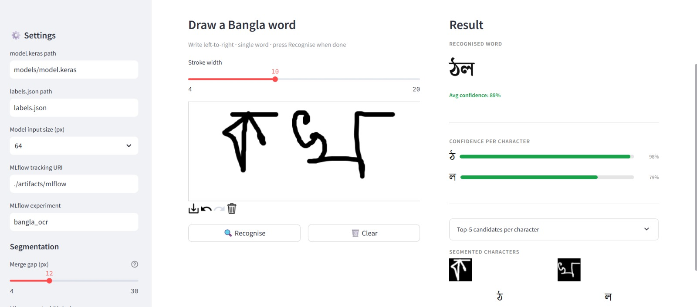

# ✍️ বাংলা OCR — Handwritten Bangla Character Recognition

A complete end-to-end system for recognising handwritten Bangla words: draw a word on a canvas → the app segments it into characters → a MobileNetV2 model predicts each character → the full word is displayed with confidence scores.

---

## Project Structure

```
bangla-ocr/
├── train.py                      # Training script (two MLflow runs)
├── app.py                        # Streamlit prediction UI
├── requirements.txt              # Python dependencies
├── Dockerfile                    # Container definition for the Streamlit app
├── README.md
├── labels.json                   # Index → Unicode char map (produced by train.py)
├── models/
│   └── model.keras               # Saved model (produced by train.py)
├── artifacts/
│   └── mlflow/                   # MLflow tracking directory (produced by train.py)
└── screenshots/
    ├── streamlit_app.png         # UI screenshot
    └── mlflow_experiment.png     # MLflow run comparison screenshot
```

---

## Screenshots

### Streamlit App


### MLflow Experiment Tracking


---

## Dataset

**BanglaLekha-Isolated** — Mendeley Data
<https://data.mendeley.com/datasets/hf6sf8zrkc/2>

- ~166 000 grayscale images across 84 classes
- Classes 01–50: 50 basic consonants and independent vowels (ক খ গ … ও)
- Classes 51–60: 10 Bangla numerals (০–৯)
- Classes 61–84: 24 common compound characters (ক্ষ জ্ঞ …)

**Setup:**

```bash
# After downloading, unzip so images live at:
data/BanglaLekha-Isolated/<class_folder>/*.png
```

---

## Technical Approach

### Preprocessing

Both training images and canvas strokes pass through the same pipeline:

| Step | Training images | Canvas strokes |
|---|---|---|
| Read | `tf.io.read_file` + `decode_image` | RGBA array from `st_canvas` |
| Grayscale | RGB decode (3-channel) | `cv2.COLOR_RGBA2GRAY` |
| Invert | white bg → black bg | `cv2.bitwise_not` (canvas is white-bg) |
| Binarise | implicit via normalisation | `cv2.threshold` at 20 |
| Resize | `tf.image.resize` → img_size × img_size | `cv2.resize` → img_size × img_size |
| Normalise | divide by 255 → [0, 1] | divide by 255 → [0, 1] |
| Channel | 3-channel RGB | `cv2.COLOR_GRAY2RGB` |

**Data augmentation** (training only): random horizontal flip, brightness ±15 %, contrast ×[0.8, 1.2].

---

### Model Architecture

Transfer learning on **MobileNetV2** (ImageNet weights):

```
Input (img_size × img_size × 3)
  └─ MobileNetV2 preprocess_input  (rescale [0,1] → [-1,1])
  └─ MobileNetV2 base (frozen in Phase 1, top-50 layers unfrozen in Phase 2)
  └─ GlobalAveragePooling2D
  └─ BatchNormalization
  └─ Dropout (0.3)
  └─ Dense 256, ReLU
  └─ Dropout (0.3)
  └─ Dense 84, Softmax
```

Loss: categorical cross-entropy | Metrics: accuracy, Top-3 accuracy | Optimiser: Adam

---

### Training

Two training phases, each recorded as a separate **MLflow run**:

**Phase 1 — Warm-up** (`run_name="mobilenetv2_warmup"`)
The MobileNetV2 base is fully frozen; only the classification head is trained.
Callbacks: `ModelCheckpoint`, `ReduceLROnPlateau`, `EarlyStopping`.

**Phase 2 — Fine-tuning** (`run_name="mobilenetv2_finetune"`)
The best checkpoint from Phase 1 is loaded. The top-50 layers of the base are unfrozen and trained end-to-end at a 10× lower learning rate.

```bash
python train.py \
  --data_dir        data/BanglaLekha-Isolated \
  --img_size        64 \
  --batch_size      64 \
  --epochs          30 \
  --fine_tune_epochs 10 \
  --lr              1e-3 \
  --fine_tune_lr    1e-4
```

Outputs written automatically:

| File / Folder | Description |
|---|---|
| `models/model.keras` | Best fine-tuned checkpoint |
| `labels.json` | `{ "index_to_char": {"0": "ক", …} }` |
| `artifacts/mlflow/` | MLflow experiment tracking data |

The `models/` and `artifacts/mlflow/` directories are created automatically if they do not exist.

---

### Word Segmentation Strategy

Because the model is an **isolated-character classifier**, the app segments a drawn word into individual characters before inference.

**Algorithm — vertical projection segmentation:**

1. **Binarise** the canvas image (inverted so strokes are white on black).
2. **Vertical projection**: sum pixel values along each column → 1-D profile.
3. **Run detection**: scan the profile left-to-right; a run starts when a column is non-zero and ends when it returns to zero.
4. **Minimum width filter**: discard runs narrower than `min_width` pixels (noise removal).
5. **Gap merging**: adjacent runs separated by ≤ `merge_gap` columns are merged into one segment (handles disconnected strokes within the same character, e.g. dots/matras of ি ী ু ূ).
6. **Tight vertical crop**: find the topmost and bottommost non-zero row per segment, then add small padding.
7. **Square-pad & resize**: each crop is padded to square, resized to `img_size × img_size`, and normalised to [0, 1].

Both `merge_gap` and `min_width` are adjustable in the Streamlit sidebar at runtime.

---

## MLflow Tracking

Every `python train.py` call produces **exactly two MLflow runs** under the `bangla_ocr` experiment, stored in `artifacts/mlflow/`:

| Run name | What is tracked |
|---|---|
| `mobilenetv2_warmup` | img_size, batch_size, epochs, lr, num_classes, sample counts, per-epoch loss / accuracy / top-3, test metrics, model artefact |
| `mobilenetv2_finetune` | fine_tune_epochs, fine_tune_lr, unfrozen_layers, warmup_run_id, per-epoch metrics, test metrics, final model artefact |

**Browse runs in the MLflow UI:**

```bash
mlflow ui --backend-store-uri ./artifacts/mlflow
# open http://127.0.0.1:5000
```

The Streamlit sidebar also shows a live summary of all runs — click **🔄 Refresh runs**.

---

## Streamlit UI

Key features:

- **Drawable canvas** — freehand drawing with adjustable stroke width.
- **Recognise button** — segments strokes, runs batch inference, displays results.
- **Recognised word** — full Bangla word assembled from per-character predictions.
- **Confidence bars** — colour-coded per character (green ≥ 75 %, amber ≥ 45 %, red < 45 %).
- **Top-5 candidates** — expandable table showing the 5 most likely characters per segment.
- **Character thumbnails** — shows the actual cropped/resized segment fed to the model.
- **MLflow run browser** — sidebar panel listing all training runs with val / test accuracy.
- **Demo mode** — if `models/model.keras` is absent the app runs with random predictions so the UI can be evaluated without training.

---

## Docker Usage

### Build

```bash
docker build -t bangla-ocr .
```

### Run

Mount the trained artefacts from the host (train outside Docker first):

```bash
docker run -p 8501:8501 \
  -v "$(pwd)/models:/app/models:ro" \
  -v "$(pwd)/labels.json:/app/labels.json:ro" \
  -v "$(pwd)/artifacts:/app/artifacts:ro" \
  bangla-ocr
```

On **Windows PowerShell** replace `$(pwd)` with `${PWD}`.

Open <http://localhost:8501> in your browser.

**Demo mode without artefacts** — omit the `-v` flags; the app starts in demo mode (random predictions), useful to verify the container builds and runs correctly before training:

```bash
docker run -p 8501:8501 bangla-ocr
```

---

## Quick-start (local)

```bash
# 1. Clone / copy project files
git clone <your-repo> && cd bangla-ocr

# 2. Create a virtual environment
python -m venv .venv
source .venv/bin/activate        # Windows: .venv\Scripts\activate

# 3. Install dependencies
pip install -r requirements.txt

# 4. Download dataset
#    → https://data.mendeley.com/datasets/hf6sf8zrkc/2
#    Unzip to:  data/BanglaLekha-Isolated/

# 5. Train  (creates models/model.keras, labels.json, artifacts/mlflow/)
python train.py --data_dir data/BanglaLekha-Isolated

# 6. Launch the UI
streamlit run app.py
```
